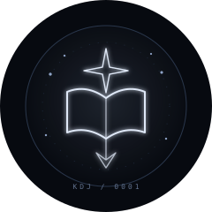
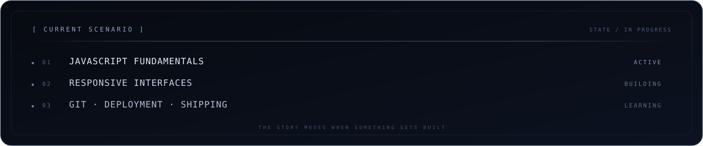
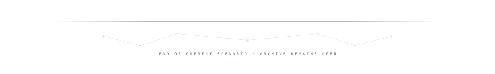

<div align="center">

<picture>
  <source media="(prefers-color-scheme: dark)" srcset="./assets/orv-header.svg" />
  <source media="(prefers-color-scheme: light)" srcset="./assets/orv-header-light.svg" />
  
</picture>

<br/>

<picture>
  <source media="(prefers-color-scheme: dark)" srcset="./assets/reader-sigil.svg" />
  <source media="(prefers-color-scheme: light)" srcset="./assets/reader-sigil-light.svg" />
  
</picture>

# KDJ

`reader` · `student developer` · `interface builder`

<sub>I read systems until I understand them. Then I build.</sub>

<br/>


<br/><br/>

<sub><a href="#01--reader">READER</a> &nbsp;·&nbsp; <a href="#02--current-scenario">SCENARIO</a> &nbsp;·&nbsp; <a href="#03--stack">STACK</a> &nbsp;·&nbsp; <a href="#04--protocol">PROTOCOL</a> &nbsp;·&nbsp; <a href="#05--current-build">BUILD</a> &nbsp;·&nbsp; <a href="#06--constellation-trail">CONSTELLATION</a> &nbsp;·&nbsp; <a href="#07--archive">ARCHIVE</a></sub>

</div>

<br/>

## `01 / reader`

```text
IDENTITY    KDJ
MODE        observe → understand → build → iterate
FOCUS       frontend · interfaces · useful web experiences
STATUS      in progress
```

I learn by making things real. I’m interested in the point where **code, structure, and visual design** stop feeling like separate pieces and begin working as one system.

The goal is simple: build interfaces that are clear enough to understand, deliberate enough to remember, and useful enough to deserve existing.

<br/>

## `02 / current scenario`

<picture>
  <source media="(prefers-color-scheme: dark)" srcset="./assets/system-panel.svg" />
  <source media="(prefers-color-scheme: light)" srcset="./assets/system-panel-light.svg" />
  
</picture>

<br/>

## `03 / stack`

<table>
<tr>
<td width="33%" valign="top">

**Structure**

`HTML`  
semantic pages · accessible foundations

</td>
<td width="33%" valign="top">

**Interface**

`CSS`  
layout · responsiveness · visual systems

</td>
<td width="33%" valign="top">

**Behaviour**

`JavaScript`  
interaction · state · browser logic

</td>
</tr>
<tr>
<td width="33%" valign="top">

**Versioning**

`Git` · `GitHub`  
trace decisions · preserve useful history

</td>
<td width="33%" valign="top">

**Shipping**

`GitHub Pages` · `Actions`  
turn work into something people can visit

</td>
<td width="33%" valign="top">

**Next**

`Next.js`  
after the foundations are strong

</td>
</tr>
</table>

<br/>

## `04 / protocol`

<table>
<tr>
<td width="33%" align="center"><b>01 · clarity</b><br/><sub>Every element earns its place.</sub></td>
<td width="33%" align="center"><b>02 · curiosity</b><br/><sub>Understand the system beneath the surface.</sub></td>
<td width="33%" align="center"><b>03 · completion</b><br/><sub>Ship, learn, refine, repeat.</sub></td>
</tr>
</table>

<br/>

## `05 / current build`

### Scenario

A local-first productivity app for turning goals into focused, trackable scenarios.

`HTML` · `CSS` · `JavaScript` · `localStorage` · `GitHub Actions`

[**open app ↗**](https://khademadib.github.io/scenario/) &nbsp;&nbsp; [**source ↗**](https://github.com/khademadib/scenario)

<sub>create · prioritize · search · filter · complete · persist locally</sub>

<br/>

## `06 / constellation trail`

<sub>Every contribution leaves a trace.</sub>

<br/><br/>

<picture>
  <source media="(prefers-color-scheme: dark)" srcset="https://raw.githubusercontent.com/khademadib/khademadib/output/contribution-grid-dark.svg" />
  <source media="(prefers-color-scheme: light)" srcset="https://raw.githubusercontent.com/khademadib/khademadib/output/contribution-grid.svg" />
  
</picture>

<br/>

## `07 / archive`

<details>
<summary><code>open archive manifest</code></summary>

<br/>

```text
ARCHIVE     KDJ / 0001
OBJECTIVE   learn deeply · build deliberately · finish what matters
DIRECTION   stronger fundamentals → better systems → better work
STATE       the next page is unwritten
```

</details>

<br/>

<div align="center">

**Read carefully. Build deliberately.**  
<sub>Leave the next page better than the last.</sub>

<br/><br/>

<picture>
  <source media="(prefers-color-scheme: dark)" srcset="./assets/archive-footer.svg" />
  <source media="(prefers-color-scheme: light)" srcset="./assets/archive-footer-light.svg" />
  
</picture>

</div>
